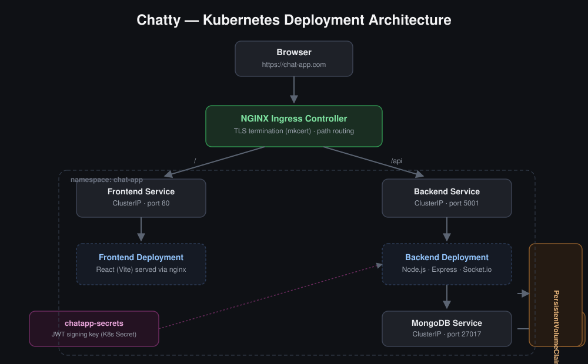
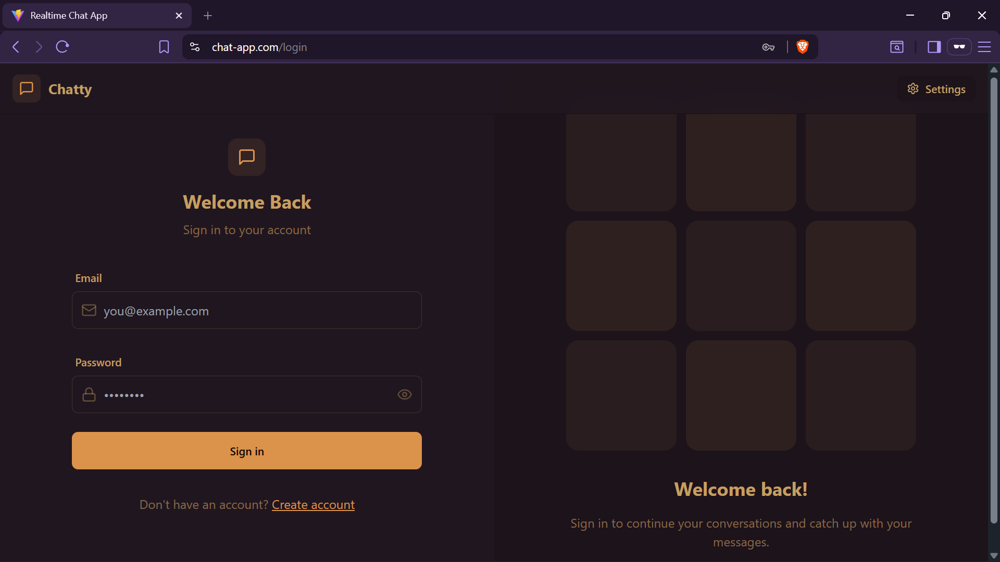
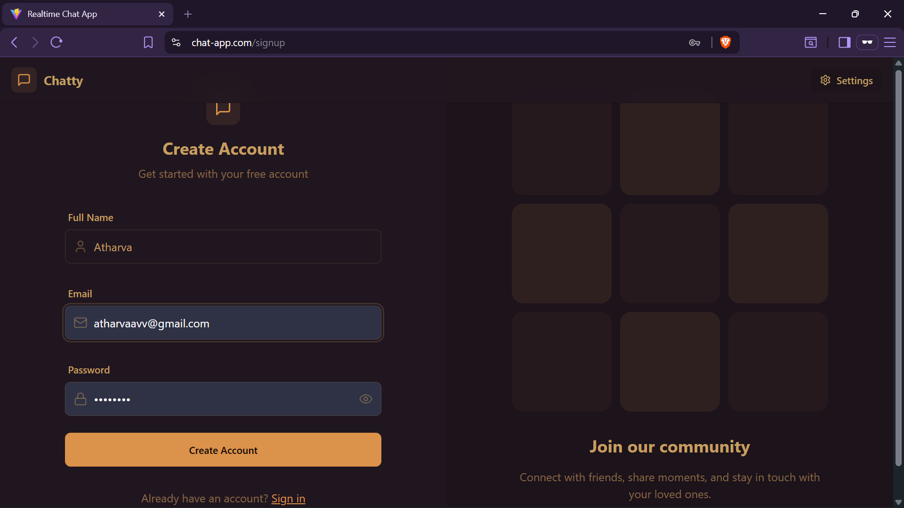
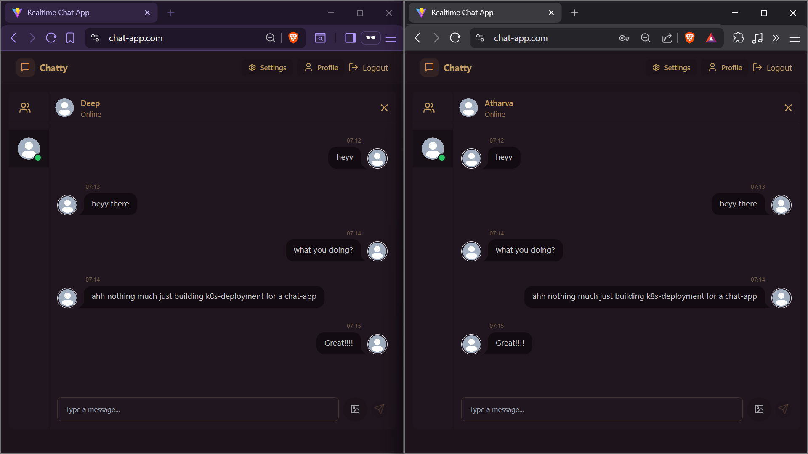
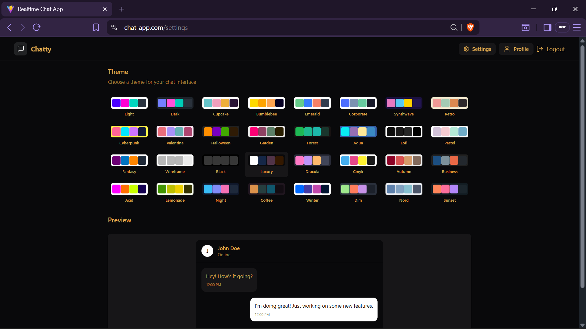

<div align="center">

# 🗨️ Chatty
### Real-Time Chat Application — Deployed on Kubernetes

*A MERN-stack chat app packaged, orchestrated, and served through a self-managed Kubernetes stack — Ingress routing, TLS termination, persistent storage, and inter-service networking, all configured and debugged from scratch.*


</div>

---

## 📐 Architecture



A single Ingress Controller handles TLS termination and routes traffic by path: `/` to the frontend, `/api` to the backend. Backend and MongoDB communicate over Kubernetes' internal Service DNS, with MongoDB data persisted through a PersistentVolumeClaim so it survives pod restarts.

---

## 🧰 Tech Stack

| Layer | Technology |
|---|---|
| Frontend | React (Vite), Tailwind CSS |
| Backend | Node.js, Express, Socket.io |
| Database | MongoDB |
| Containerization | Docker |
| Orchestration | Kubernetes (Minikube) |
| Ingress / Routing | Ingress-NGINX |
| TLS | mkcert — locally-trusted CA for real HTTPS in local dev |
| Auth | JWT, httpOnly cookies |

---

## ✨ Features

- **Real-time messaging** over WebSockets via Socket.io — verified working across two independent authenticated sessions (see screenshot below)
- **JWT-based authentication** with `httpOnly`, `secure` cookies and protected API routes
- **Persistent storage** — MongoDB data backed by a Kubernetes PersistentVolumeClaim, not ephemeral pod storage
- **Path-based Ingress routing** — one Ingress resource cleanly splits frontend and API traffic
- **Locally-trusted HTTPS** — a proper certificate chain via `mkcert`, not a self-signed cert your browser flags as insecure
- **Custom theming** — 30+ selectable chat UI themes

---

## 📸 Screenshots

<table>
<tr>
<td width="50%">

**Sign In**


</td>
<td width="50%">

**Create Account**


</td>
</tr>
<tr>
<td colspan="2">

**Real-time messaging — two independent logged-in sessions, verified live**


</td>
</tr>
<tr>
<td colspan="2">

**Theming**


</td>
</tr>
</table>

---

## 🚀 Running Locally

### Prerequisites
- [Minikube](https://minikube.sigs.k8s.io/docs/start/)
- [kubectl](https://kubernetes.io/docs/tasks/tools/)
- [Docker](https://docs.docker.com/get-docker/)
- [mkcert](https://github.com/FiloSottile/mkcert)

### 1. Start Minikube with Ingress enabled
```bash
minikube start
minikube addons enable ingress
```

### 2. Clone and enter the repo
```bash
git clone https://github.com/<your-username>/chatty-k8s-deployment.git
cd chatty-k8s-deployment
```

### 3. Create the namespace and secrets
```bash
kubectl apply -f k8s/namespace.yml
```
`k8s/secrets.yml` ships with placeholder values only. Create the real secret imperatively instead of editing the tracked file:
```bash
kubectl create secret generic chatapp-secrets \
  --from-literal=jwt=$(openssl rand -base64 32) \
  -n chat-app
```

### 4. Deploy MongoDB, backend, and frontend
```bash
kubectl apply -f k8s/mongodb-pv.yml
kubectl apply -f k8s/mongodb-pvc.yml
kubectl apply -f k8s/mongodb-deployement.yml
kubectl apply -f k8s/mongodb-service.yml
kubectl apply -f k8s/backend-deployment.yml
kubectl apply -f k8s/backend-service.yml
kubectl apply -f k8s/frontend-deployment.yml
kubectl apply -f k8s/frontend-service.yml
```

### 5. Set up local HTTPS
```bash
mkcert -install
mkcert chat-app.com
kubectl create secret tls chatapp-tls \
  --cert=chat-app.com.pem \
  --key=chat-app.com-key.pem \
  -n chat-app
```

### 6. Apply the Ingress
```bash
kubectl apply -f k8s/ingress.yml
```

### 7. Map the domain locally
Add to your hosts file (`C:\Windows\System32\drivers\etc\hosts` on Windows, `/etc/hosts` on Linux/macOS):
```
127.0.0.1    chat-app.com
```

### 8. Start the tunnel
```bash
minikube tunnel
```
Keep this running in its own terminal — it bridges Ingress traffic to `127.0.0.1`.

### 9. Open the app
```
https://chat-app.com
```

---

## 🧩 Engineering Notes — Problems Found and Fixed

Real issues hit and resolved during this deployment, not a scripted tutorial walkthrough:

- **Inter-service DNS resolution** — nginx inside the frontend container failed with `host not found in upstream "backend"`. Kubernetes only resolves Service names, not pod IPs or arbitrary hostnames — the fix was creating explicit `backend` and `mongodb` Services so CoreDNS could resolve them.
- **CrashLoopBackOff root-caused via logs, not guesswork** — the backend pod cycled through `Pulled → Created → Started → BackOff` repeatedly despite a healthy image pull. `kubectl logs` traced it to a missing `MONGODB_URI` environment variable, not a Kubernetes or networking fault.
- **Ingress path rewriting silently broke API routing** — `nginx.ingress.kubernetes.io/rewrite-target: /` was rewriting *every* matched path to `/` before forwarding, so `/api/auth/login` arrived at the backend as `/`. Removing the blanket rewrite restored correct path-based routing.
- **cert-manager reconciliation loop** — after switching from a cert-manager-issued self-signed certificate to a manually-created `mkcert` TLS secret, cert-manager kept detecting the secret as "missing" and silently regenerating it every few minutes, overwriting the manual cert. Traced via `kubectl logs -n cert-manager` to a leftover `Certificate` resource still bound to the Ingress annotation — removing the `cert-manager.io/cluster-issuer` annotation and the orphaned `Certificate` object stopped the reconciliation loop for good.
- **Host-level resource contention across multiple local clusters** — running a `kind` cluster and a Minikube cluster simultaneously on the same WSL2 host caused `kind create cluster` to fail with a systemd boot-target timeout. Root cause was the host's `inotify` watch/instance limits being exhausted across both clusters' containerd/kubelet processes — resolved by raising `fs.inotify.max_user_watches` and `fs.inotify.max_user_instances`, and stopping unused cluster nodes to free contested ports (80/443) for `minikube tunnel`.
- **Secure cookies over plain HTTP** — login succeeded but every subsequent authenticated request returned `401`. The JWT cookie was flagged `secure: true` while the app was served over plain HTTP, so the browser silently refused to store or transmit it. Solved properly with real TLS via `mkcert`, rather than disabling the `secure` flag.

---

## ⚠️ Local Development Scope

This is a **local development deployment**, not a production configuration. Specifically:
- TLS uses a locally-trusted certificate (`mkcert`) rather than a publicly-trusted CA like Let's Encrypt, since `chat-app.com` isn't a real, publicly-resolvable domain
- `minikube tunnel` and a hosts-file entry are used to route local traffic — a production setup would use a real LoadBalancer and DNS record
- Secrets are created imperatively via `kubectl create secret` rather than a secrets manager (e.g. Sealed Secrets, Vault, or a cloud provider's secret store)

---

## 📄 License

MIT — see [LICENSE](LICENSE).
